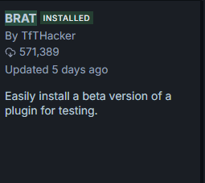
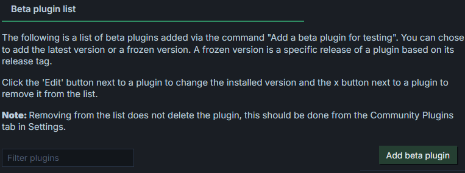
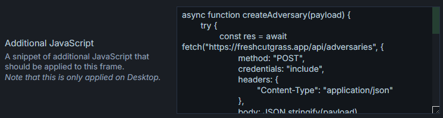
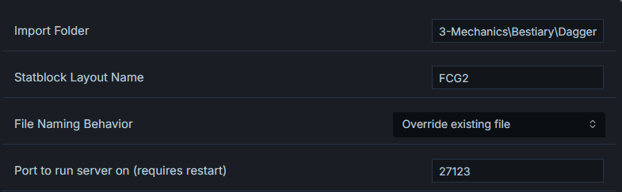

# How to make the plugin work

## Prerequisites

This plugin requires Obsidian Custom Frames to work properly.

## Installation

Install using BRAT

and then using BRAT plugin settings add a plugin

## Copy the contents of .obsidian/plugins/obsidian-freshcutgrass/src/server.js to a Custom Frame

## Modify Options if needed

