# FreshCutGrass Integration

## What it does

The plugin can synchronize your local [Obsidian](https://obsidian.md) Vault with your [FreshCutGrass](https://freshcutgrass.app) application library.

You can import your homebrew and library saved adversaries and environments to your local Obsidian vault, edit your homebrew adversaries in Obsidian and sync it with the library.

The plugin was created for usage with Fantasy Statblocks with rolling dice support
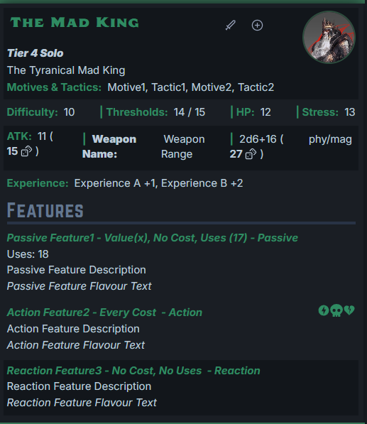

## Prerequisites

This plugin requires Obsidian Custom Frames to work properly.
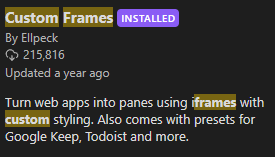

Thi plugin works best with Fantasy Statblocks plugin
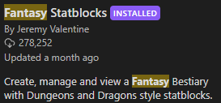

## Installation

Install BRAT comunity plugin

and then using the BRAT plugin settings add a plugin

Enter Repository `https://github.com/Hijtec/obsidian-freshcutgrass` and choose Latest version
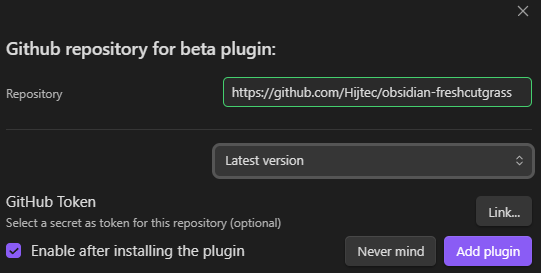

This will install the plugin into your obsidian vault.

Makes sure all of the needed plugins are enabled
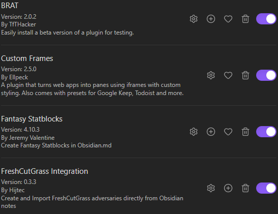

## Fantasy Statblocks Layout Import

Download the `FCG2.json` file from
<https://github.com/Hijtec/obsidian-freshcutgrass/releases>

In Fantasy Statblocks plugin settings, import the `FCG2.json` file
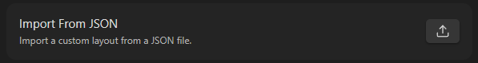

## Setup the Custom Frame Server

Download the `server.js` file from
<https://github.com/Hijtec/obsidian-freshcutgrass/releases>

Create a new Custom Frame
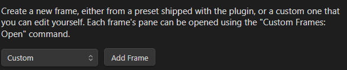

Go into its setting, name it however you like.

Set the URL to `https://freshcutgrass.app`
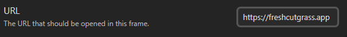

Copy the contents of the `server.js` file to the Custom Frame Additional Javascript field.

Restart or reload Obsidian

### Modify Options if needed

For example the Import Folder is the folder you sync your adversaries in

Modifying the options requires restart of Obsidian

### Open Custom Frame

Use command CustomFrames: Open {YourChosenCustomFrameNameHere}
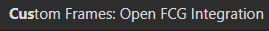

Login using Discord
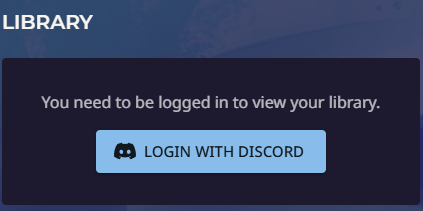

Restart Obsidian.

You can now use the Plugin Commands.

## Available Obsidian Commands

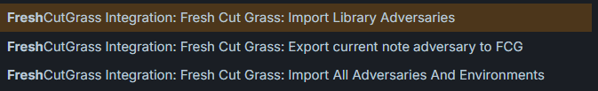

## Roadmap

- [ ] Make images work (local/remote)
- [ ] Fix Fantasy Statblocks, they render in 5e for no fucking reason
- [ ] Prettier Fantasy Statblock for Environments
- [ ] Support ToneAndFeel fields for Environments
- [ ] Make it work with <https://github.com/javalent/initiative-tracker>
- [ ] UX improvements
